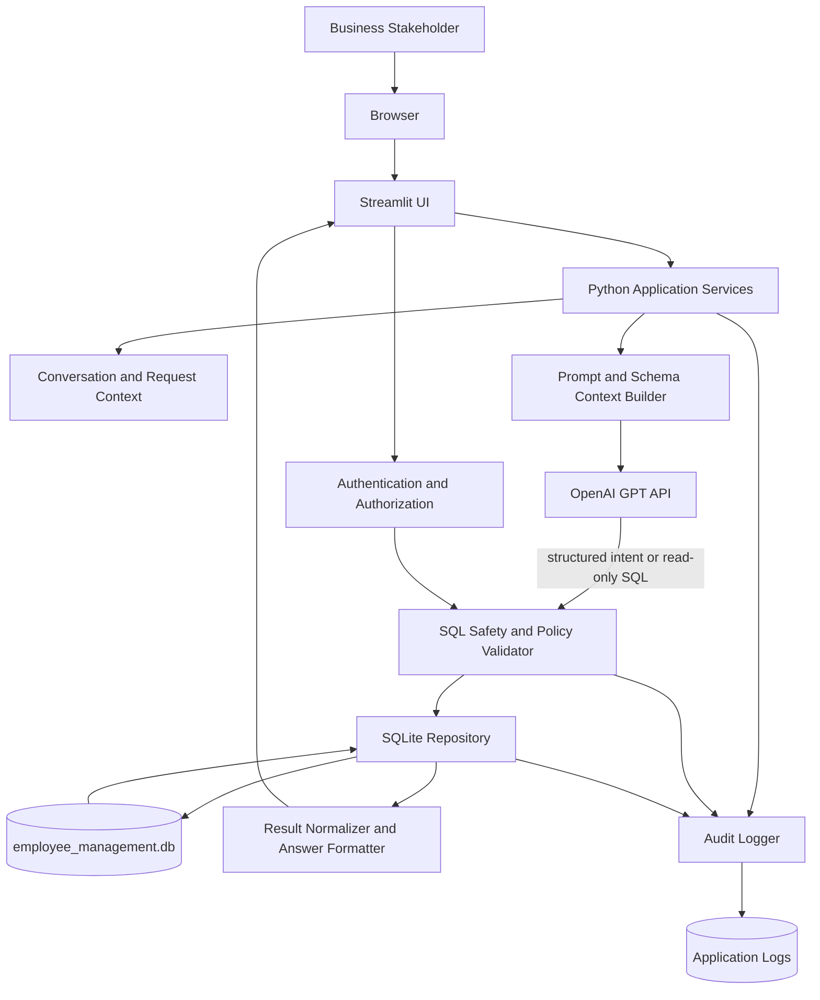
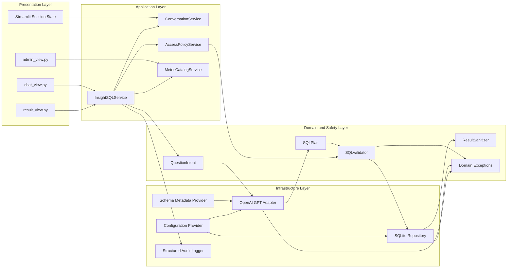
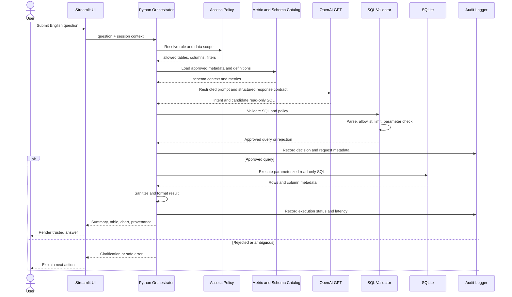
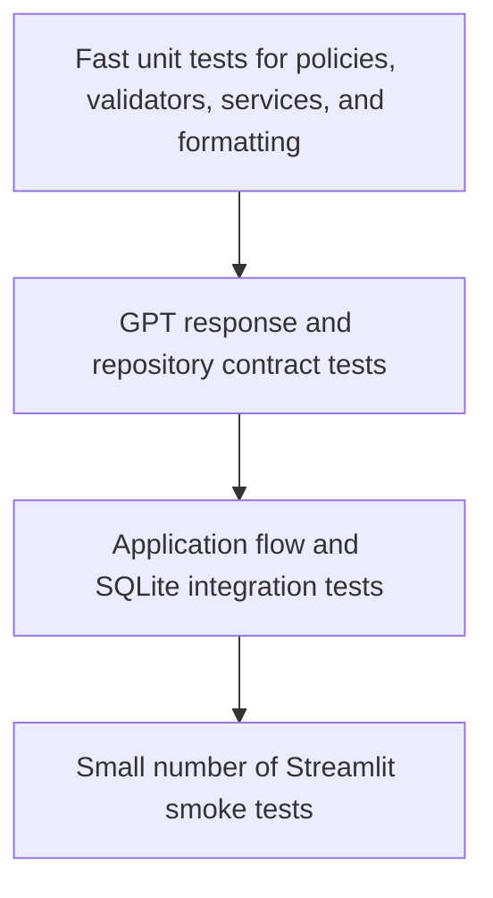

# InsightSQL Architecture Design

## Architecture Context

InsightSQL is a Streamlit application that lets authorized workforce stakeholders ask database questions in English. The MVP uses Python for application and domain logic, SQLite for the employee-management data store, OpenAI GPT for natural-language understanding and answer generation, and Pytest for automated verification.

The architecture is intentionally read-only at the database boundary. GPT proposes structured query intent or SQL, but application-owned validation and authorization decide whether a query can execute. GPT never receives database credentials and should receive only the minimum schema, metadata, and query result context required for the request.

### Core Architectural Decisions

- **Presentation:** Streamlit provides the browser-based conversational interface and result visualizations.
- **Application orchestration:** Python coordinates authentication context, conversation state, prompt construction, query validation, execution, and response formatting.
- **AI integration:** An `LLMClient` interface isolates the OpenAI GPT SDK from the rest of the application.
- **Data access:** A repository layer owns SQLite connections and parameterized read-only queries.
- **Safety boundary:** SQL validation, allowlists, limits, and authorization run in Python before SQLite execution.
- **Testability:** Business logic is separated from Streamlit session state and external services so Pytest can test it deterministically.

## 1. Architecture Diagram



### Request Lifecycle

1. The user submits an English question through Streamlit.
2. The application resolves the authenticated user's role and data-access scope.
3. The context builder selects approved schema metadata, metric definitions, and relevant conversation history.
4. The OpenAI adapter requests a structured query plan or SQL from GPT.
5. The validator rejects unsafe SQL, disallowed tables or columns, mutations, missing limits, and unauthorized filters.
6. The SQLite repository executes only approved, read-only statements with bounded parameters.
7. The result normalizer converts rows into a safe application model.
8. The answer formatter creates a concise explanation, table, chart, assumptions, and provenance.
9. The UI renders the answer and the audit logger records the request outcome without secrets.

## 2. Component Diagram



### Component Responsibilities

| Component | Responsibility | Must Not Do |
|---|---|---|
| `chat_view.py` | Collect questions, show conversation, and submit actions. | Generate SQL or contain business rules. |
| `result_view.py` | Render summaries, tables, charts, assumptions, and errors. | Re-query the database directly. |
| `InsightSQLService` | Orchestrate one question from input through answer. | Store credentials or bypass policy checks. |
| `AccessPolicyService` | Resolve user role, permitted tables, columns, and row filters. | Infer authorization from prompt text. |
| `MetricCatalogService` | Provide governed metric definitions and ownership metadata. | Let GPT invent authoritative metric definitions. |
| `OpenAI GPT Adapter` | Call GPT using a strict response contract and timeout. | Execute SQL or receive database credentials. |
| `SQLValidator` | Enforce read-only syntax, allowlists, limits, and policy constraints. | Trust model output without parsing and validation. |
| `SQLite Repository` | Open controlled connections and execute approved queries. | Accept arbitrary SQL from the UI. |
| `ResultSanitizer` | Remove or mask sensitive fields and normalize result types. | Alter results silently without recording the policy. |
| `Structured Audit Logger` | Record request IDs, decisions, latency, and outcomes. | Log API keys, raw secrets, or unnecessary personal data. |

## 3. Data Flow Diagram



### Data Handling Boundaries

- **User input:** Treated as untrusted text. It is length-limited, normalized, and included in prompts as data, not as instructions.
- **GPT response:** Treated as untrusted output. It is parsed against a strict schema and validated before any execution.
- **Database rows:** Stay inside the application process unless a minimal, policy-approved result is sent to GPT for wording. Raw sensitive rows should not be sent to GPT.
- **Rendered answer:** Contains only authorized, sanitized aggregates or rows.
- **Logs:** Contain metadata and decision outcomes, not credentials or unrestricted result payloads.

## 4. Folder Structure

```text
SQL_APP/
|-- app.py                          # Streamlit entry point
|-- requirements.txt                # Runtime dependencies
|-- pyproject.toml                  # Tooling, formatting, and Pytest configuration
|-- .env.example                    # Documented variable names; no secrets
|-- .gitignore
|-- README.md
|-- architecture_design.md
|-- database_design.md
|-- project_discovery.md
|-- schema.sql
|-- seed.sql
|-- employee_management.db          # Local development database
|
|-- insightsql/
|   |-- __init__.py
|   |-- config.py                   # Typed environment and app settings
|   |-- dependencies.py             # Composition root and dependency wiring
|   |
|   |-- ui/
|   |   |-- __init__.py
|   |   |-- chat_view.py
|   |   |-- result_view.py
|   |   |-- admin_view.py
|   |   |-- components.py
|   |
|   |-- application/
|   |   |-- __init__.py
|   |   |-- service.py              # Main use-case orchestration
|   |   |-- conversation_service.py
|   |   |-- access_policy_service.py
|   |   |-- metric_catalog_service.py
|   |
|   |-- domain/
|   |   |-- __init__.py
|   |   |-- models.py               # Question, SQL plan, answer, user context
|   |   |-- policies.py             # Supported domains and privacy rules
|   |   |-- exceptions.py
|   |   |-- validators.py            # SQL and input validation
|   |
|   |-- infrastructure/
|       |-- __init__.py
|       |-- llm/
|       |   |-- base.py             # LLMClient protocol/interface
|       |   |-- openai_client.py
|       |   |-- prompts.py
|       |-- database/
|       |   |-- connection.py
|       |   |-- repository.py
|       |   |-- metadata.py
|       |-- observability/
|           |-- logging.py
|           |-- audit.py
|
|-- tests/
    |-- conftest.py
    |-- unit/
    |   |-- test_validators.py
    |   |-- test_services.py
    |   |-- test_result_sanitizer.py
    |-- integration/
    |   |-- test_sqlite_repository.py
    |   |-- test_question_flow.py
    |-- contract/
        |-- test_llm_response_schema.py
```

### Dependency Direction

`ui` depends on `application`; `application` depends on `domain` abstractions; `infrastructure` implements those abstractions. Domain code must not import Streamlit, OpenAI SDK objects, or SQLite connection details. This keeps core behavior testable without a browser, network, or live model.

## 5. Security Strategy

### Identity and Authorization

- Require authentication before exposing workforce data.
- Represent each request with a `UserContext` containing user ID, role, and permitted data scope.
- Apply authorization after question interpretation and before SQL execution.
- Use allowlists for approved tables, columns, metric definitions, and query operations.
- Enforce row-level filters through application-owned policy definitions or SQLite views; never ask GPT to enforce authorization.
- Keep the database connection read-only at the operating-system or deployment level where possible.

### Secrets and Configuration

- Store `OPENAI_API_KEY` and any database credentials in environment variables or a secrets manager.
- Commit only `.env.example`; never commit real secrets.
- Do not place secrets in Streamlit widgets, prompt text, exception messages, or logs.
- Use separate credentials and databases for development, test, and production.
- Rotate API keys and database credentials according to organizational policy.

### GPT-Specific Controls

- Use a system prompt that defines the assistant role, allowed data domain, output schema, and refusal behavior.
- Delimit user text and explicitly treat it as untrusted content.
- Prefer structured query intent over free-form SQL generation where practical.
- Validate the model response with a schema model before use.
- Do not send full employee rows to GPT when an aggregate or local formatting step is sufficient.
- Add model and prompt version identifiers to audit records.

### SQL and Database Controls

- Permit only `SELECT` statements and approved read-only constructs.
- Reject multiple statements, comments used to obscure operations, DDL, DML, attached databases, PRAGMA changes, and unsafe functions.
- Enforce table and column allowlists, parameterized values, maximum row counts, query timeouts, and result-size limits.
- Use a separate read-only SQLite connection for application queries.
- Enable `PRAGMA foreign_keys = ON` and validate database integrity during startup or health checks.
- Mask or suppress small-group and sensitive results according to privacy policy.

### Privacy and Operational Controls

- Minimize collection of prompts, results, and conversation history.
- Define retention periods for prompts, generated SQL, audit records, and feedback.
- Provide an access review and incident response process.
- Prevent individual-level employment recommendations and other high-impact decisions in the MVP.
- Test prompt injection, SQL injection, access bypass, inference attacks, and sensitive-data leakage before release.

## 6. Logging Strategy

### Logging Goals

Logging must make a request diagnosable and auditable while avoiding secrets and unnecessary employee data. Logs should be structured JSON in deployed environments and human-readable during local development.

### Correlation and Required Fields

Every request receives a generated `request_id`. Logs should include, where applicable:

- `timestamp` in UTC
- `request_id`
- `session_id` as a non-sensitive internal identifier
- `user_id_hash` or approved pseudonymous identifier
- `event_type`
- `component`
- `model_name` and `prompt_version`
- `schema_version`
- `authorization_decision`
- `query_fingerprint`, not unrestricted SQL where avoidable
- `row_count` and `result_size_bytes`
- `duration_ms`
- `outcome` and `error_code`

### Event Categories

| Event | Level | Example Fields |
|---|---|---|
| Question received | INFO | request ID, user role, input length |
| Authorization decision | INFO/WARN | policy, allowed domain, decision |
| GPT request completed | INFO | model, latency, token usage, response validation |
| Query blocked | WARN | rejection code, query fingerprint, policy reason |
| Query executed | INFO | fingerprint, duration, row count, timeout status |
| Sensitive result suppressed | WARN | policy code, aggregate dimensions |
| External service failure | ERROR | provider, retry count, error code |
| Unexpected application failure | ERROR | request ID, component, sanitized stack trace |
| Authentication or access failure | WARN | user pseudonym, source, reason code |

### Redaction and Retention

- Never log API keys, database connection strings, passwords, access tokens, or raw authorization headers.
- Do not log raw employee rows, full prompts, or full model responses by default.
- If raw prompts are required for an approved debugging workflow, encrypt them, restrict access, and apply a short retention period.
- Use log levels so production can suppress debug content without a code change.
- Forward security-relevant events to centralized monitoring and alert on repeated query blocks, access failures, and abnormal extraction patterns.

## 7. Exception Handling Strategy

### Principles

- Handle expected failures at the boundary that understands them.
- Convert low-level exceptions into typed, user-safe application exceptions.
- Preserve the original exception for internal diagnostics without exposing it to the user.
- Fail closed for authorization, validation, and data-privacy decisions.
- Never retry validation failures or unsafe model output.

### Exception Categories

| Exception | Typical Cause | User Experience | Action |
|---|---|---|---|
| `InvalidQuestionError` | Empty, oversized, or unsupported input. | Ask the user to revise the question. | No external call or database execution. |
| `AmbiguousQuestionError` | Missing time range or undefined term. | Show a clarification question. | Preserve context; do not execute. |
| `LLMTimeoutError` | GPT request exceeded timeout. | Explain temporary unavailability. | Retry only safe, idempotent calls with backoff. |
| `LLMResponseError` | Invalid or incomplete structured response. | Explain that the answer could not be interpreted. | Log response metadata; do not execute. |
| `QueryValidationError` | Mutation, disallowed object, or missing limit. | Explain that the request is not permitted. | Audit rejection; do not execute. |
| `AuthorizationError` | User lacks required data access. | Show a permission-safe message. | Audit denial; never reveal restricted schema. |
| `DatabaseTimeoutError` | SQLite query exceeds resource limit. | Offer a narrower question. | Cancel/close cursor; record timeout. |
| `DatabaseExecutionError` | Connection or SQL execution failure. | Show a retryable or support message. | Roll back transaction state and log sanitized details. |
| `DataPrivacyError` | Result violates masking or group-size policy. | Explain that the result is suppressed. | Return no sensitive data; audit policy event. |
| `UnexpectedApplicationError` | Unhandled programming or platform fault. | Show a generic error with request ID. | Log stack trace internally and alert as appropriate. |

### Boundary Behavior

- **Streamlit boundary:** Catch typed application exceptions and render stable messages; do not display stack traces in production.
- **OpenAI boundary:** Apply a timeout, bounded retry with exponential backoff for transient failures, and response-schema validation.
- **Database boundary:** Use context managers, close cursors, set query limits, and ensure no partial state is presented as a successful answer.
- **Policy boundary:** Treat uncertainty as denial or clarification rather than guessing.
- **Logging boundary:** Attach the request ID to every exception and redact sensitive values before emission.

### User-Facing Error Contract

Each error shown to a user should contain:

- A short explanation in plain language.
- Whether the user can revise and retry.
- A request ID for support when applicable.
- No SQL credentials, internal paths, model prompts, stack traces, or restricted metadata.

## 8. Testing Strategy

### Test Pyramid



### Unit Tests

Use deterministic fixtures and fake implementations of `LLMClient`, repositories, and policy providers to test:

- Input normalization, length limits, and unsupported question handling.
- Clarification behavior for ambiguous questions.
- Prompt context construction without leaking restricted metadata.
- GPT response parsing and schema validation.
- SQL read-only validation, allowlists, statement limits, and prohibited constructs.
- Authorization and row-filter composition.
- Result masking, small-group suppression, null handling, and chart-selection logic.
- Error mapping and user-safe message formatting.
- Conversation context truncation and follow-up question behavior.

### Contract Tests

- Validate that GPT responses conform to the expected structured schema.
- Test model refusal, malformed JSON, missing fields, extra fields, and prompt-injection-like content.
- Mock the OpenAI SDK at the adapter boundary so tests do not depend on network availability or live model behavior.
- Verify repository interfaces return stable domain models and typed errors.

### Integration Tests

Use a temporary SQLite database created from `schema.sql` and `seed.sql` to verify:

- Foreign keys, constraints, and indexes.
- Department, employee, project, and assignment queries.
- Full question-to-answer orchestration with a fake GPT client.
- Authorization filters are applied before execution.
- Query limits, timeouts, and result sanitization.
- Audit events are produced for success, rejection, and failure paths.

### Streamlit Smoke Tests

Run a small number of browser-level tests for:

- Application startup and database health check.
- Question submission and result rendering.
- Clarification flow.
- Safe error rendering.
- Keyboard-accessible interaction with the primary question flow.

### Security and Resilience Tests

- SQL injection and multi-statement payloads.
- Prompt injection and instruction-conflict payloads.
- Attempts to access disallowed tables, columns, or small groups.
- Secret scanning and log-redaction checks.
- Invalid or expired authentication contexts.
- GPT timeout, rate limit, malformed response, and provider outage scenarios.
- Database lock, corruption, and unavailable-file scenarios.

### Quality Gates

A change is ready for merge when:

- Unit, contract, and integration tests pass.
- The SQL validator has coverage for every blocked operation and allowlist rule.
- No new secret or sensitive-data logging is introduced.
- Static checks and formatting pass.
- The SQLite schema and seed scripts build a valid test database.
- Critical authorization and privacy tests pass.
- Tests do not require a live OpenAI API key unless explicitly marked as an opt-in evaluation test.

### Suggested Commands

```powershell
pytest -q
pytest tests/unit -q
pytest tests/integration -q
python -m streamlit run app.py
```

## Recommended Initial Delivery Sequence

1. Package the existing SQLite schema and seed data behind a repository interface.
2. Implement typed domain models, access policies, and SQL validation before adding GPT calls.
3. Add a fake GPT client and complete the question orchestration with deterministic tests.
4. Add the OpenAI adapter with structured output, timeouts, redaction, and model versioning.
5. Build the Streamlit chat and result views on top of the application service.
6. Add observability, security tests, and a small end-to-end smoke suite before pilot release.
