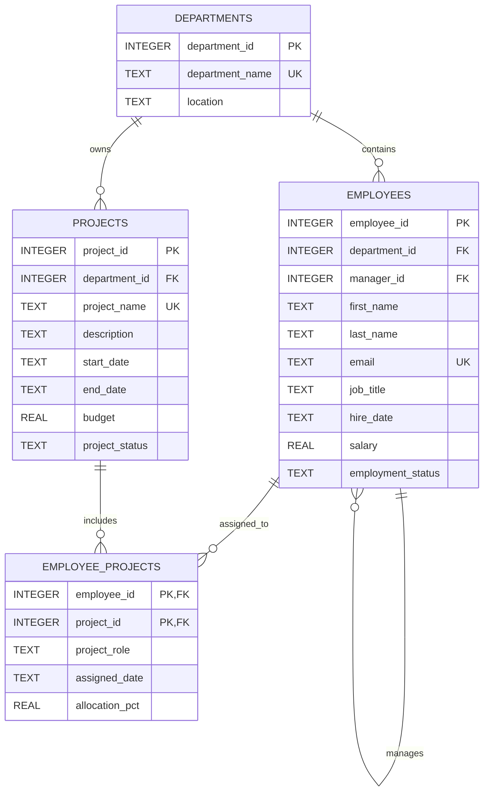

# Employee Management System Database Design

## 1. ER Diagram



## 2. Table Definitions

### departments

Stores the organizational departments. Each department name is unique.

| Column | Type | Required | Description |
|---|---|---:|---|
| department_id | INTEGER | Yes | Surrogate identifier. |
| department_name | TEXT | Yes | Unique department name. |
| location | TEXT | No | Primary office or operating location. |

### employees

Stores employee identity, employment, reporting, and compensation data. `manager_id` is a self-referencing relationship to support reporting hierarchies.

| Column | Type | Required | Description |
|---|---|---:|---|
| employee_id | INTEGER | Yes | Surrogate identifier. |
| department_id | INTEGER | Yes | Department assignment. |
| manager_id | INTEGER | No | Direct manager; null for top-level employees. |
| first_name | TEXT | Yes | Employee first name. |
| last_name | TEXT | Yes | Employee last name. |
| email | TEXT | Yes | Unique business email. |
| job_title | TEXT | Yes | Current job title. |
| hire_date | TEXT | Yes | ISO-8601 date in `YYYY-MM-DD` format. |
| salary | REAL | Yes | Annual salary; must be non-negative. |
| employment_status | TEXT | Yes | `Active`, `On Leave`, or `Inactive`. |

### projects

Stores projects owned by departments and their delivery status.

| Column | Type | Required | Description |
|---|---|---:|---|
| project_id | INTEGER | Yes | Surrogate identifier. |
| department_id | INTEGER | Yes | Department responsible for the project. |
| project_name | TEXT | Yes | Unique project name. |
| description | TEXT | No | Business purpose or scope. |
| start_date | TEXT | Yes | ISO-8601 project start date. |
| end_date | TEXT | No | ISO-8601 completion date; cannot precede start date. |
| budget | REAL | Yes | Approved budget; must be non-negative. |
| project_status | TEXT | Yes | `Planned`, `Active`, `Completed`, or `On Hold`. |

### employee_projects

Associative table implementing the many-to-many relationship between employees and projects. The composite primary key prevents duplicate assignments.

| Column | Type | Required | Description |
|---|---|---:|---|
| employee_id | INTEGER | Yes | Assigned employee. |
| project_id | INTEGER | Yes | Assigned project. |
| project_role | TEXT | Yes | Role performed on the project. |
| assigned_date | TEXT | Yes | ISO-8601 assignment date. |
| allocation_pct | REAL | Yes | Planned allocation from 0 to 100 percent. |

## 3. Primary Keys

- `departments.department_id`
- `employees.employee_id`
- `projects.project_id`
- Composite key: `employee_projects.employee_id, employee_projects.project_id`

## 4. Foreign Keys

- `employees.department_id` references `departments.department_id`.
- `employees.manager_id` references `employees.employee_id`.
- `projects.department_id` references `departments.department_id`.
- `employee_projects.employee_id` references `employees.employee_id`.
- `employee_projects.project_id` references `projects.project_id`.

Foreign-key enforcement is enabled in the SQLite schema with `PRAGMA foreign_keys = ON`.

## 5. Sample Data

The seed dataset contains:

- 5 departments: Engineering, Human Resources, Finance, Sales, and Operations.
- 20 employees distributed across all departments.
- 10 projects owned by the departments.
- Employee-project assignments covering project roles and allocation percentages.
- Reporting relationships through `employees.manager_id`.
- Active, on-leave, and inactive employee statuses.
- Planned, active, completed, and on-hold project statuses.

The complete sample rows are in [seed.sql](seed.sql).

## 6. Create Table Scripts

The executable SQLite DDL is in [schema.sql](schema.sql). It creates all four tables, constraints, indexes, and foreign-key relationships.

Run it with:

```powershell
sqlite3 employee_management.db ".read schema.sql"
```

## 7. Insert Scripts

The executable sample-data DML is in [seed.sql](seed.sql).

Run it with:

```powershell
sqlite3 employee_management.db ".read seed.sql"
```

## Design Notes

- The schema is normalized around departments, employees, projects, and the employee-project assignment relationship.
- Dates use ISO-8601 text so SQLite sorts them correctly and remains portable across applications.
- Compensation and project budget use `REAL` for the sample SQLite implementation; production financial reporting should use a currency-safe strategy appropriate to the consuming application.
- Employee records are retained for historical reporting, with `employment_status` distinguishing inactive employees from current staff.
